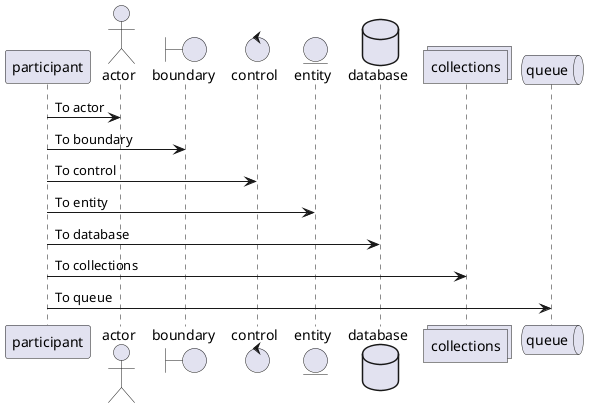

+++ 
draft = false
date = 2024-01-02T14:37:18+01:00
title = "Tiktok Clone Appwrite Schema"
slug = ""
authors = []
tags = []
categories = []
externalLink = ""
series = []
tableOfContents = true
+++

## Tiktok Clone Schema

### Profile Collection


Alice -> Bob: test





@startuml firstDiagram

Alice -> Bob: Hello
Bob -> Alice: Hi!

@enduml


> Profile
```
Document_id
Image
Bio
User_id
Name
```

### Post Collection

> Post
```
Document_id
User_id
Video_url
Text
Created_at
```

### Like Collection

> Like
```
Document_id
User_id
Post_id
```

### Comment Collection

> Post
```
Document_id
User_id
Post_id
Text
Created_at
```

## Fetch Data Hooks

#### useGetCommentsByPostId

**Method:** 
```
useGetCommentsByPostId = async (postId: string)`
```
**Return:**
```
id: comment?.$id, 
user_id: comment?.user_id,
post_id: comment?.post_id,
text: comment?.text,
created_at: comment?.created_at,
profile: {
    user_id: profile?.user_id,  
    name: profile?.name,
    image: profile?.image,
}
```
**Algorithm:*
```javascript
const useGetCommentsByPostId = async (postId: string) => {
    try {
        const commentsResult = await database.listDocuments(
            String(process.env.NEXT_PUBLIC_DATABASE_ID), 
            String(process.env.NEXT_PUBLIC_COLLECTION_ID_COMMENT), 
            [ 
                Query.equal('post_id', postId),
                Query.orderDesc("$id")
            ]
        );

        const objPromises = commentsResult.documents.map(async comment => {
            const profile = await useGetProfileByUserId(comment.user_id)

            return {
                id: comment?.$id, 
                user_id: comment?.user_id,
                post_id: comment?.post_id,
                text: comment?.text,
                created_at: comment?.created_at,
                profile: {
                    user_id: profile?.user_id,  
                    name: profile?.name,
                    image: profile?.image,
                }
            }
        })

        const result = await Promise.all(objPromises)
        return result
    } catch (error) {
        throw error
    }
}
```
